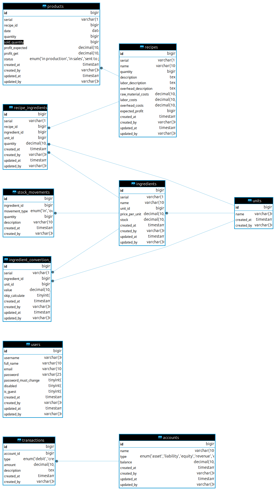

# Database Schema

1. [Table users](01-user.md)
2. [Table units](02-unit.md)
3. [Table ingredients](03-ingredient.md)
4. [Table ingredient_conversion_units](04-ingredient-conversion-unit.md)
5. [Table recipes](05-recipe.md)
6. [Table recipe_ingredients](06-recipe-ingredient.md)
7. [Table stock_movements](07-stock-movement.md)
8. [Table products](08-product.md)
9. [Table accounts](09-account.md)
10. [Table transactions](10-transaction.md)

### Diagram

